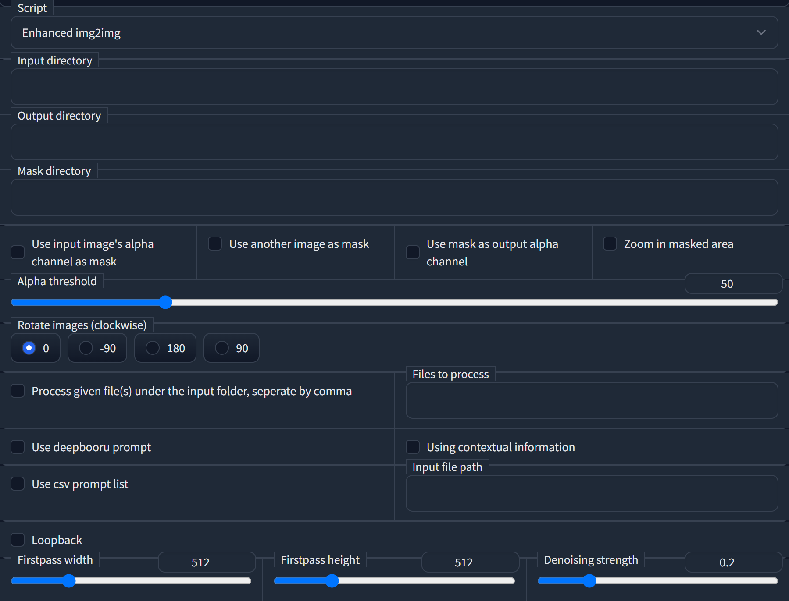

# Enhanced img2img

This is an extension for [AUTOMATIC111's WebUI](https://github.com/AUTOMATIC1111/stable-diffusion-webui), support for batched and better inpainting.

## Install

See [official wiki](https://github.com/AUTOMATIC1111/stable-diffusion-webui/wiki/Extensions).

## Usage

Switch to **"img2img"** tab, under the **"script"** column, select **"enhanced img2img"**.

  - **Input directory**: a folder containing all the images you want to process.
  - **Output directory**: a folder to save output images.
  - **Mask directory**: a folder containing all the masks. *Not essential*.
  - **Use input image's alpha channel as mask**: if your original images are PNG files with transparent backgrounds, you can use this option to create outputs with transparent backgrounds. *Note: when this option is selected, the masks in the "**mask directory**" will not be used.*
  - **Use another image as mask**: use masks in the "**mask directory**" to inpaint images. *Note: if the relevant masks are blank images or no mask is provided, the original images will not be processed.*
  - **Use mask as output alpha channel**: as it says. *Note: when the "**use input image's alpha channel as mask**" option is selected, this option is automatically activated.*
  - **Zoom in masked area**: crop and resize the masked area to square images; this will give better results when the masked area is relatively small compared to the original images.
  - **Alpha threshold**: alpha value for determine background and foreground.
  - **Rotate images (clockwise)**: as it says, this can improve AI's performance when the original images are upside down.
  - **Process given file(s) under the input folder, separate by comma**: process certain image(s) from the text box right to it; if this option is not checked, all the images under the folder will be processed.
  - **Files to process**: filenames of images you want to process. I recommend naming your images with a digit suffixes, e.g. `000233.png, 000234.png, 000235.png, ...` or `image_233.jpg, image_234.jpg, image_235.jpg, ...`. In this way, you can use `233,234,235` or simply `233-235` to assign these files. Otherwise, you need to give the full filenames like `image_a.webp,image_b.webp,image_c.webp`.
  - **Use deepbooru prompt**: use DeepDanbooru to predict image tags; if you have input some prompts in the prompt area, it will append to the end of the prompts.
  - **Using contextual information**: only if tags are present in both current and next frames' prediction results, this can improve accuracy (maybe).
  - **Use csv prompt list** and **input file path**: use a `.csv` file as prompts for each image, one line for one image.
  - **Loopback**: similar to the loopback script, this will run input images img2img twice to enhance AI's creativity. 
  - **Firstpass width** and **firstpass height**: AI tends to be more creative when the firstpass size is smaller.
  - **Denoising strength**: denoising strength for the first pass, better be no higher than 0.4.

## Credit

AUTOMATIC1111's WebUI - https://github.com/AUTOMATIC1111/stable-diffusion-webui
